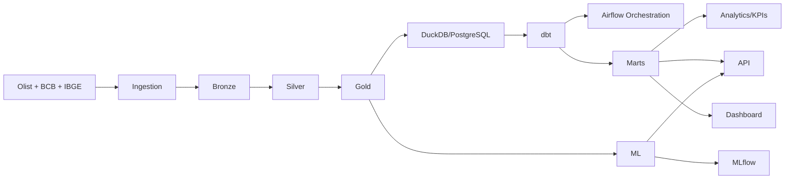

# Architecture

## Objetivo Analitico

Responder como indicadores economicos brasileiros se relacionam com vendas, pedidos, ticket medio, categorias, clientes, vendedores, logistica e avaliacoes do e-commerce.

## Fluxo Geral

## Data Lake

- Bronze: preserva dados proximos da fonte, adicionando `source`, `source_file`, `ingestion_timestamp` e `batch_id`.
- A ingestao Olist gera manifesto por lote em `data/bronze/olist/_manifests`.
- As ingestoes BCB e IBGE sao disparadas por CLI a partir de `config/economic_indicators.json`.
- A validacao Bronze verifica metadados obrigatorios em arquivos Parquet e gera relatorio em `data/bronze/_quality_reports`.
- A execucao Bronze completa esta documentada em `docs/bronze_layer.md`.
- Silver: dados limpos, tipados, padronizados, validados e preparados para integracao.
- A Silver e construida a partir do ultimo Parquet de cada dataset Bronze e documentada em `docs/silver_layer.md`.
- A Silver adiciona flags de qualidade e preserva registros suspeitos para decisao posterior, em vez de remove-los silenciosamente.
- A qualidade Silver cobre chaves, dominios aceitos, integridade referencial, datas, valores invalidos e outliers IQR com NumPy.
- Gold: datasets de negocio, como `sales_daily`, `sales_monthly`, `category_performance`, `economic_indicators`, `sales_economic_features`, `customer_rfm`, `ml_features` e `anomaly_metrics`.
- A Gold e construida com DuckDB sobre Parquets Silver e salva datasets analiticos em Parquet.
- Os grains Gold estao documentados em `docs/gold_layer.md`.

## Fontes Oficiais Validadas

- Banco Central SGS: `https://api.bcb.gov.br/dados/serie/bcdata.sgs.{codigo_serie}/dados?formato=json&dataInicial={DD/MM/AAAA}&dataFinal={DD/MM/AAAA}`.
- IBGE/SIDRA: `https://apisidra.ibge.gov.br/values/t/{tabela}/...`.

## Grains Iniciais

- `fact_sales`: uma linha por item de pedido.
- `fact_orders`: uma linha por pedido.
- `fact_payments`: uma linha por pagamento registrado do pedido.
- `fact_delivery`: uma linha por pedido entregue ou com status logistico.
- `fact_reviews`: uma linha por review.
- `fact_economic_indicators`: uma linha por indicador por data/periodo de referencia.

## Star Schema Planejado

Dimensoes: `dim_date`, `dim_customer`, `dim_product`, `dim_category`, `dim_seller`, `dim_location`, `dim_economic_indicator`.

Fatos: `fact_sales`, `fact_orders`, `fact_payments`, `fact_delivery`, `fact_reviews`, `fact_economic_indicators`.

## Decisoes

- Parquet com PyArrow sera o formato principal do Data Lake por eficiencia colunar e compatibilidade com Pandas/DuckDB.
- DuckDB sera usado para analise local sobre Parquet antes da carga em PostgreSQL.
- DuckDB ja e usado na construcao da Gold local.
- PostgreSQL sera tratado como Data Warehouse dimensional, nao como simples copia de CSVs.
- O Data Warehouse PostgreSQL inicial usa schemas `raw`, `staging`, `analytics` e `monitoring`.
- O star schema inicial e documentado em `docs/warehouse.md`.
- dbt possui camadas `staging`, `intermediate` e `marts` preparadas para o schema `analytics`.
- PostgreSQL local isolado em `localhost:55432` foi carregado com 9 tabelas analiticas.
- dbt materializa marts no schema `analytics_marts`.
- Airflow orquestra Bronze, Silver, Gold, Warehouse, dbt, Analytics e ML por meio da CLI existente.
- Analytics/KPIs, correlacoes economicas, forecast, segmentacao, anomalias e inteligencia de reviews estao documentados em `docs/analytics_ml.md`.
- MLflow rastreia experimentos locais em `mlflow.db` e registra metricas, parametros, modelos e artefatos dos processos de ML.
- FastAPI expoe contratos tipados para KPIs, series Gold, rankings, segmentos, anomalias e relatorios de ML.
- Streamlit consome a FastAPI local e apresenta paginas executivas, analiticas e de ML para exploracao do projeto.
- Docker Compose orquestra PostgreSQL, MLflow, FastAPI, Streamlit e Airflow para execucao reproduzivel.
- GitHub Actions valida lint, DAG, imports principais e testes automatizados.
- Observabilidade gera checks operacionais sobre Gold, outputs de ML e relatorios, expondo status pela API e pelo dashboard.
- NumPy sera usado em estatisticas, outliers, features vetorizadas e anomalias.
- Pipelines externos serao configuraveis, evitando endpoints e identificadores espalhados pelo codigo.
