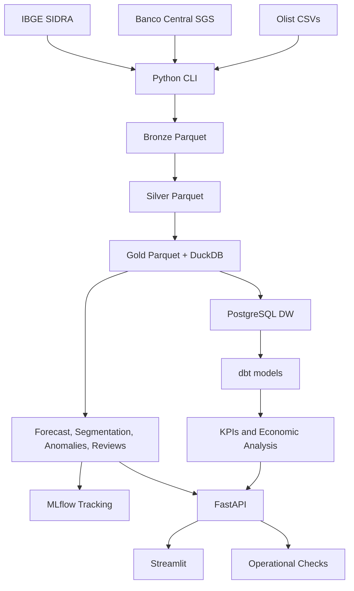
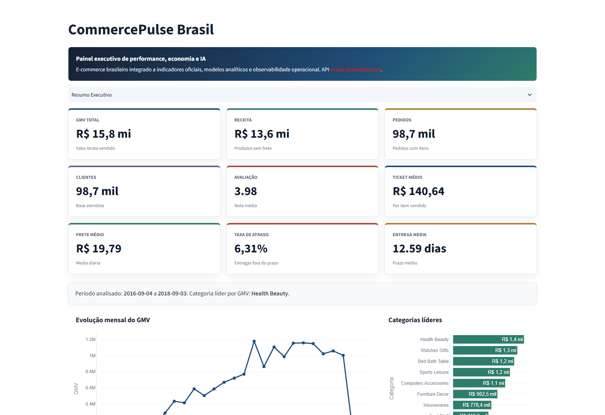
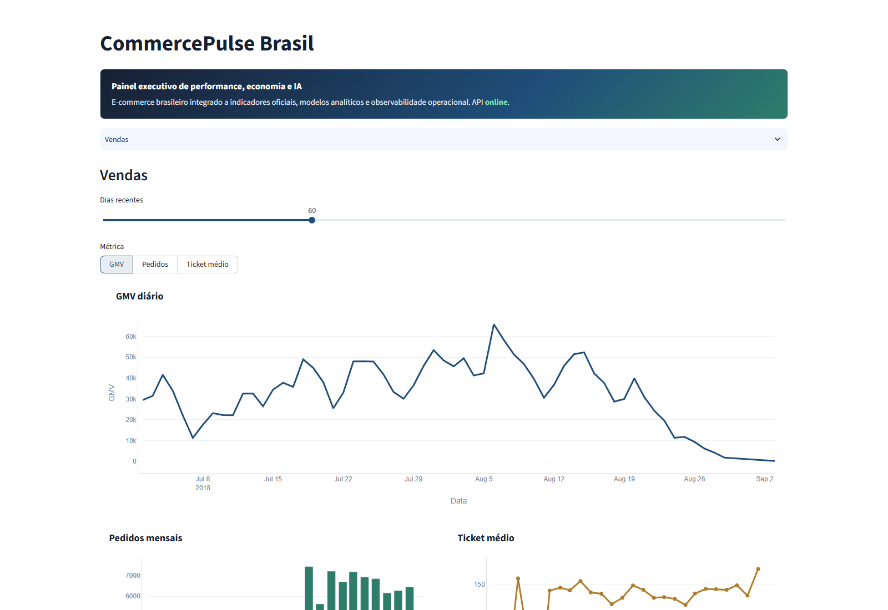
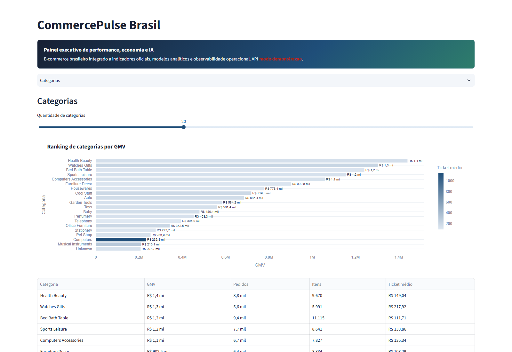
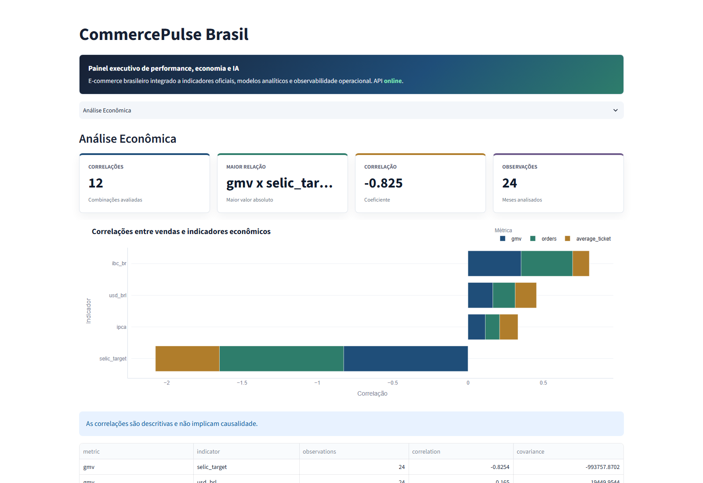
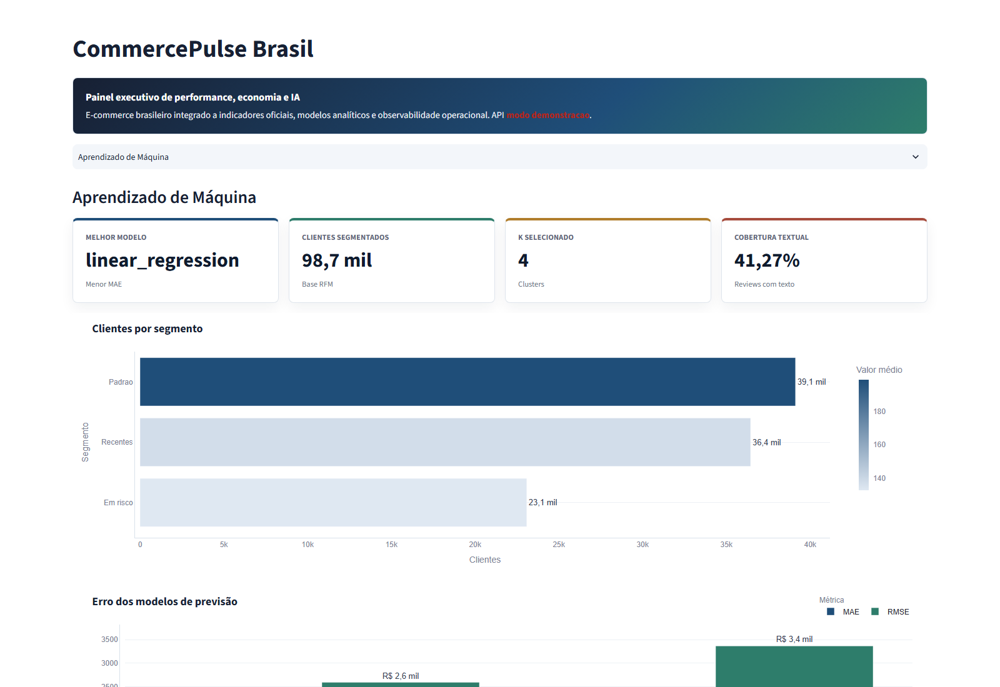
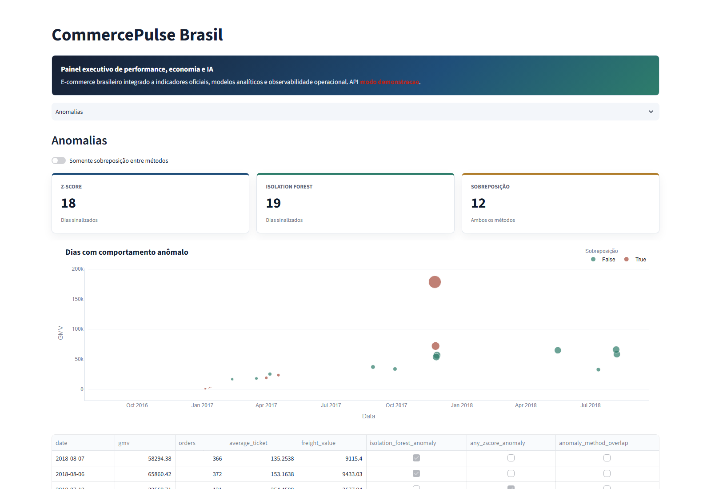
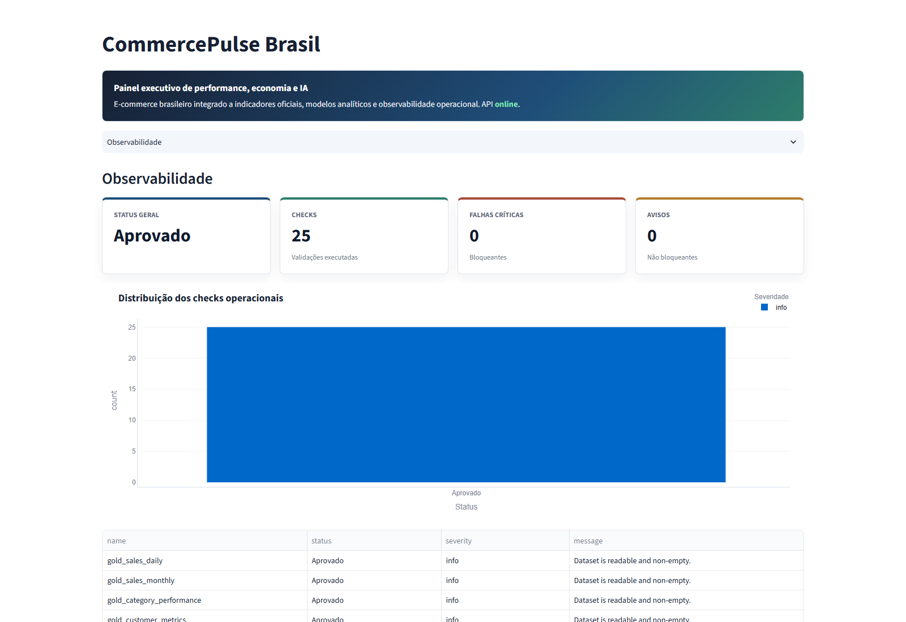
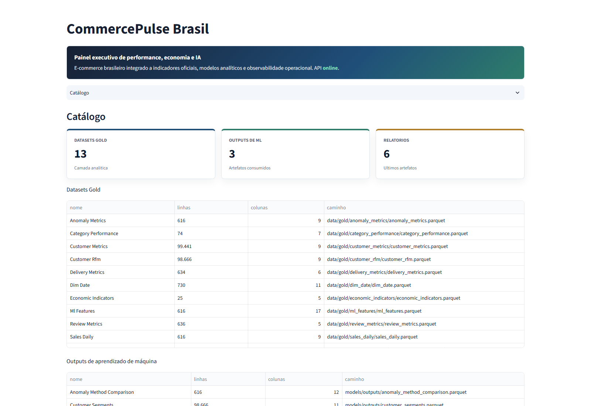

# CommercePulse Brasil

Plataforma de Engenharia de Dados e Inteligencia Artificial aplicada a e-commerce brasileiro e indicadores macroeconomicos oficiais.

## Objetivo

Investigar como variaveis economicas brasileiras se relacionam com vendas, pedidos, ticket medio, categorias, clientes, vendedores, frete, prazos de entrega e avaliacoes em um e-commerce.

## Arquitetura



## Stack

Python, Pandas, NumPy, Requests, PyArrow, DuckDB, PostgreSQL, dbt, Airflow, scikit-learn, MLflow, FastAPI, Streamlit, Plotly, Docker, Pytest, Ruff e GitHub Actions.

## Dashboard

Resumo executivo:



Vendas:



Categorias e analise economica:





Aprendizado de maquina, anomalias e observabilidade:







Catalogo:



## Camadas

- Bronze: dados proximos da fonte, com metadados de ingestao e manifestos.
- Silver: dados limpos, tipados, padronizados e validados.
- Gold: datasets de negocio, KPIs, features economicas, RFM, ML features e anomalias.
- Warehouse: star schema em PostgreSQL.
- dbt: staging, intermediate e marts.
- Airflow: orquestracao ponta a ponta via CLI.
- MLflow: tracking de experimentos, metricas, modelos e artefatos.
- FastAPI: contratos tipados para consumo dos dados.
- Streamlit: dashboard analitico.
- Observabilidade: checks operacionais de artefatos e relatorios.

## Fontes

- Olist Brazilian E-Commerce Public Dataset.
- Banco Central do Brasil SGS.
- IBGE/SIDRA.

## Execucao Local

```bash
python -m venv .venv
pip install -r requirements.txt
make ci
```

API:

```bash
make api
```

Dashboard:

```bash
make dashboard
```

MLflow:

```bash
make mlflow
```

Docker:

```bash
make docker-build
make docker-up
```

## Pipeline

Exemplos de comandos principais:

```bash
python -m src.pipeline ingest-olist --source-dir data/raw/olist
python -m src.pipeline ingest-bcb --start-date 01/09/2016 --end-date 30/09/2018
python -m src.pipeline ingest-ibge
python -m src.pipeline validate-bronze
python -m src.pipeline build-silver
python -m src.pipeline validate-silver
python -m src.pipeline build-gold
python -m src.pipeline validate-gold
python -m src.pipeline analytics-report
python -m src.pipeline economic-analysis
python -m src.pipeline train-forecast
python -m src.pipeline segment-customers
python -m src.pipeline detect-anomalies
python -m src.pipeline review-intelligence
python -m src.pipeline observability-report
```

## API

Principais endpoints:

- `GET /health`
- `GET /catalog`
- `GET /kpis/latest`
- `GET /sales/daily`
- `GET /sales/monthly`
- `GET /categories/top`
- `GET /customers/segments`
- `GET /anomalies`
- `GET /ml/reports/{report_type}/latest`
- `GET /observability`

Documentacao local:

```text
http://127.0.0.1:8000/docs
```

Dashboard local:

```text
http://127.0.0.1:8501
```

Dashboard no Streamlit Cloud:

```text
Main file path: streamlit_app.py
```

MLflow local:

```text
http://127.0.0.1:5000
```

## Status

- Bronze, Silver e Gold concluidas.
- PostgreSQL/Data Warehouse e dbt concluidos.
- Airflow, Docker e CI concluidos.
- Analytics, ML, MLflow, FastAPI, Streamlit e Observabilidade concluidos.
- Suite atual: `61` testes Python passando.
- Observabilidade local: `25` checks, `0` falhas, `0` avisos.

## Documentacao

- [Arquitetura](ARCHITECTURE.md)
- [Fontes de Dados](docs/data_sources.md)
- [Bronze](docs/bronze_layer.md)
- [Silver](docs/silver_layer.md)
- [Gold](docs/gold_layer.md)
- [Warehouse](docs/warehouse.md)
- [dbt](docs/dbt.md)
- [Airflow](docs/airflow.md)
- [Analytics e ML](docs/analytics_ml.md)
- [MLflow](docs/mlflow.md)
- [FastAPI](docs/api.md)
- [Streamlit](docs/dashboard.md)
- [Streamlit Cloud](docs/streamlit_cloud.md)
- [Docker e CI](docs/docker_ci.md)
- [Observabilidade](docs/observability.md)
- [Revisao Arquitetural](docs/architecture_review.md)
- [Narrativa de Portfolio](docs/portfolio.md)

## Licenca

MIT.
