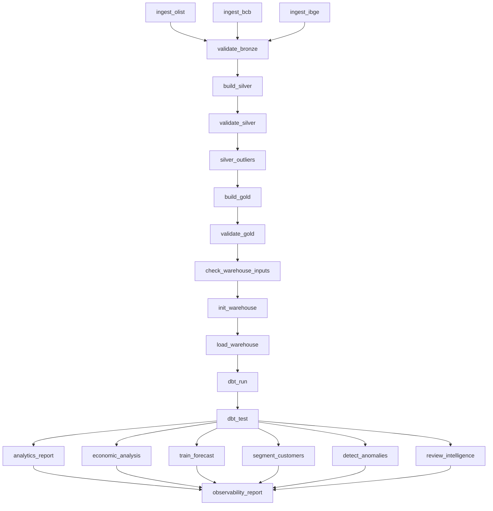

# Airflow

## Status

FASE 13 concluida em 2026-09-06.

Foi criada a DAG `commercepulse_pipeline` em:

```text
airflow/dags/commercepulse_pipeline.py
```

A DAG orquestra a CLI existente do projeto, sem duplicar logica de ingestao, transformacao, qualidade, warehouse, dbt, analytics ou ML.

## Fluxo



## Tarefas

- `ingest_olist`
- `ingest_bcb`
- `ingest_ibge`
- `validate_bronze`
- `build_silver`
- `validate_silver`
- `silver_outliers`
- `build_gold`
- `validate_gold`
- `check_warehouse_inputs`
- `init_warehouse`
- `load_warehouse`
- `dbt_run`
- `dbt_test`
- `analytics_report`
- `economic_analysis`
- `train_forecast`
- `segment_customers`
- `detect_anomalies`
- `review_intelligence`
- `observability_report`

## Configuracao

- `schedule`: diario.
- `catchup`: desabilitado.
- `max_active_runs`: 1.
- `retries`: 2.
- `retry_delay`: 5 minutos.

As credenciais e paths sao lidos por variaveis de ambiente.

## Validacao Executada

Airflow nao esta instalado no Python local do ambiente atual, mas a DAG foi estruturada para permitir validacao estatica da topologia.

Validacoes executadas:

- import local do arquivo da DAG;
- testes unitarios da topologia;
- `ruff check .`;
- `pytest`.

Resultado:

- 21 tarefas declaradas;
- dependencias Bronze -> Silver -> Gold -> Warehouse -> dbt -> Analytics/ML validadas;
- dependencias finais de observabilidade validadas;
- 52 testes Python passando;
- lint passando.

## Docker Compose

O `docker-compose.yml` inclui um servico `airflow` usando imagem oficial:

```text
apache/airflow:2.9.3-python3.11
```

Quando Docker estiver disponivel:

```bash
docker compose up -d airflow
```

Interface padrao:

```text
http://localhost:8080
```

## Observacoes

No ambiente local atual, Docker nao esta disponivel no PATH. Por isso a interface Airflow nao foi subida fisicamente aqui.

A DAG esta pronta para execucao em um ambiente com Airflow instalado ou via Docker.
